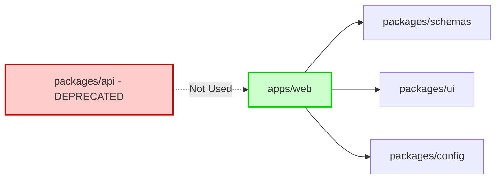
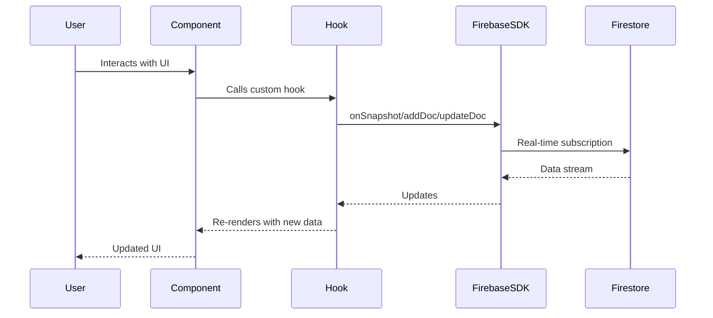
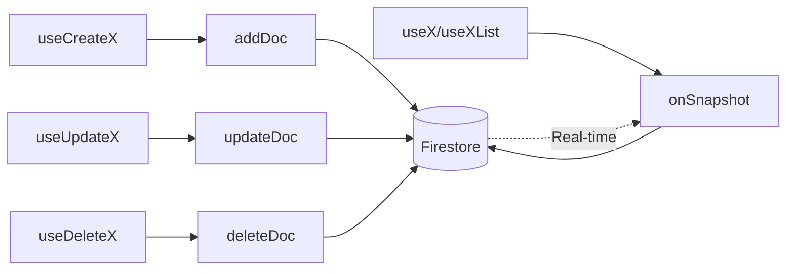
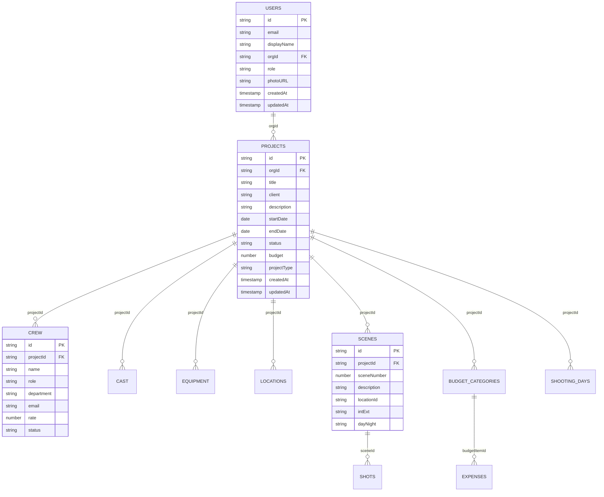
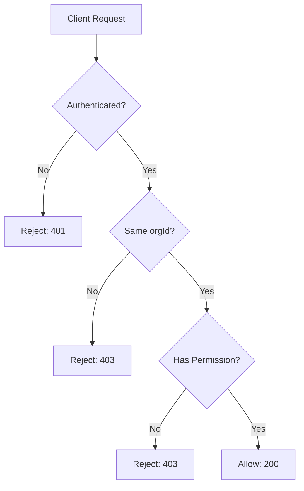
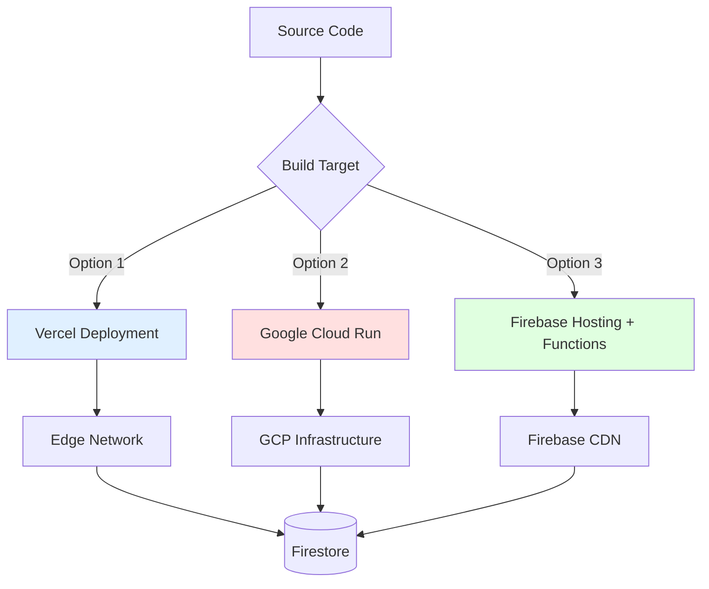
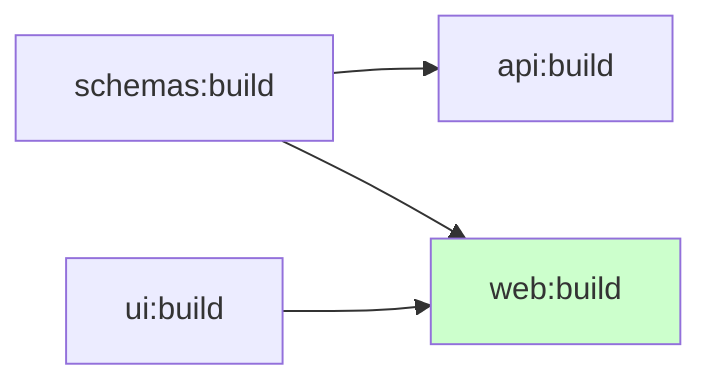

# DOUBLEcheck Architecture Documentation

> **Last Updated:** January 2026  
> **Version:** 2.0 (Firebase Client SDK Architecture)

## Table of Contents

- [Overview](#overview)
- [Technology Stack](#technology-stack)
- [Monorepo Structure](#monorepo-structure)
- [Architecture Patterns](#architecture-patterns)
- [Data Flow](#data-flow)
- [Feature Modules](#feature-modules)
- [Database Schema](#database-schema)
- [Authentication & Authorization](#authentication--authorization)
- [Deployment](#deployment)
- [Development Workflow](#development-workflow)

---

## Overview

**DOUBLEcheck** is a comprehensive production management platform designed for film and media projects. It provides tools for budget tracking, crew/cast management, location scouting, scheduling, call sheets, and equipment management.

### Key Features

- 🎬 **Project Management** - Create and manage multiple production projects
- 💰 **Budget Tracking** - Detailed budget planning with templates and analytics
- 👥 **Cast & Crew Management** - Organize talent and crew with role assignments
- 📍 **Location Management** - Scout and track filming locations with maps
- 📅 **Scheduling & Call Sheets** - Create production schedules and call sheets
- 🔧 **Equipment Tracking** - Manage production equipment inventory
- 🎨 **Storyboarding** - Scene and shot planning with reference images
- 🔐 **Multi-tenant Architecture** - Organization-based access control

---

## Technology Stack

### Frontend
- **Next.js 15** - React framework with App Router
- **React 18** - UI library
- **TypeScript 5.7** - Type safety
- **Tailwind CSS 3.4** - Utility-first styling
- **Zustand 5** - Lightweight state management

### Backend & Database
- **Firebase Client SDK 11** - Direct browser-to-Firebase communication
  - **Firestore** - NoSQL document database
  - **Firebase Auth** - User authentication
  - **Cloud Storage** - File and image storage
- **Zod** - Runtime schema validation

### Development Tools
- **pnpm** - Fast, disk-efficient package manager
- **Turbo** - Monorepo build orchestration
- **ESLint** - Code linting
- **Prettier** - Code formatting

---

## Monorepo Structure

```
doublecheck/
├── apps/
│   └── web/                          # Main Next.js application
│       ├── src/
│       │   ├── app/                  # Next.js App Router pages
│       │   ├── features/             # Feature modules (domain-driven)
│       │   ├── lib/                  # Core libraries
│       │   │   ├── firebase/         # Firebase client configuration
│       │   │   ├── schemas/          # Zod validation schemas (app-specific)
│       │   │   └── stores/           # Global state management
│       │   ├── shared/               # Shared components and utilities
│       │   └── styles/               # Global styles
│       ├── public/                   # Static assets
│       └── package.json
│
├── packages/
│   ├── schemas/                      # Shared Zod schemas (workspace package)
│   │   └── src/                      # Data model definitions
│   ├── ui/                           # Shared UI components
│   │   └── src/                      # Reusable components
│   ├── api/                          # ⚠️ DEPRECATED - Legacy tRPC routers
│   │   └── src/                      # No longer actively used
│   └── config/                       # Shared configuration
│       ├── eslint/                   # ESLint presets
│       ├── tailwind/                 # Tailwind config
│       └── typescript/               # TypeScript configs
│
├── firebase.json                     # Firebase project configuration
├── firestore.rules                   # Firestore security rules
├── firestore.indexes.json            # Database indexes
├── storage.rules                     # Storage security rules
├── turbo.json                        # Turborepo configuration
└── pnpm-workspace.yaml               # Workspace definition
```

### Package Relationships



---

## Architecture Patterns

### Current Architecture: Direct Firebase Client SDK

The application uses a **client-side first** architecture where React components communicate directly with Firebase services through the browser.



### Feature-Based Organization

The codebase follows a **feature-based** structure where related functionality is co-located:

```
features/
├── auth/                    # Authentication
│   ├── components/          # Login, SignUp forms
│   ├── hooks/               # useAuth
│   └── stores/              # authStore (Zustand)
├── projects/                # Project management
│   ├── components/          # ProjectCard, views
│   ├── hooks/               # useProjects, useProject
│   ├── stores/              # Project state
│   └── constants/           # Crew roles, equipment categories
├── budget/                  # Budget management
│   ├── components/          # Budget UI components
│   ├── hooks/               # useBudget, useExpenses
│   └── templates/           # Default budget templates
├── crew/                    # Crew management
│   ├── components/          # Crew UI
│   ├── hooks/               # useCrew, useCrewTemplates
│   └── templates/           # Crew templates by project type
├── cast/                    # Cast management
├── equipment/               # Equipment tracking
├── locations/               # Location management
├── scenes/                  # Scene & shot planning
└── integrations/            # Third-party integrations
```

---

## Data Flow

### Authentication Flow

```mermaid
graph TB
    Start[User Visits App] --> CheckAuth{Authenticated?}
    CheckAuth -->|No| Login[Login/Signup Page]
    CheckAuth -->|Yes| LoadUser[Load User Document]
    
    Login --> FirebaseAuth[Firebase Auth]
    FirebaseAuth --> CreateUser[Create User Doc in Firestore]
    CreateUser --> LoadUser
    
    LoadUser --> Subscribe[onSnapshot: users/{userId}]
    Subscribe --> AuthStore[Update authStore Zustand]
    AuthStore --> App[Render Protected App]
    
    Subscribe -.->|Real-time Updates| AuthStore
```

**Implementation:** [`apps/web/src/features/auth/hooks/useAuth.ts`](apps/web/src/features/auth/hooks/useAuth.ts)

### Data Fetching Pattern

All data fetching follows a consistent pattern using custom hooks:

```typescript
// Example: useProjects hook
export function useProjects(status?: ProjectStatus) {
  const { user } = useAuth();
  const [projects, setProjects] = useState<Project[]>([]);
  const [isLoading, setIsLoading] = useState(true);

  useEffect(() => {
    const q = query(
      collection(db, 'projects'),
      where('orgId', '==', user.orgId),
      orderBy('createdAt', 'desc')
    );

    const unsubscribe = onSnapshot(q, (snapshot) => {
      const projectList = snapshot.docs.map(doc => ({
        id: doc.id,
        ...doc.data()
      })) as Project[];
      setProjects(projectList);
      setIsLoading(false);
    });

    return () => unsubscribe();
  }, [user?.orgId]);

  return { data: projects, isLoading };
}
```

**Key Characteristics:**
- Real-time updates via `onSnapshot`
- Automatic cleanup on unmount
- Loading and error states
- Type-safe with Zod schemas

### CRUD Operations



---

## Feature Modules

### 1. Authentication (`features/auth`)

**Purpose:** User authentication and session management

**Key Files:**
- `hooks/useAuth.ts` - Main authentication hook
- `stores/authStore.ts` - Global auth state (Zustand)
- `components/LoginForm.tsx` - Login UI
- `components/SignUpForm.tsx` - Registration UI

**Data Flow:**
```
Firebase Auth → User Document (Firestore) → authStore → Protected Routes
```

### 2. Projects (`features/projects`)

**Purpose:** Core project management functionality

**Collections:**
- `projects` - Project documents

**Key Hooks:**
- `useProjects(status?)` - List projects by org
- `useProject(id)` - Single project subscription
- `useCreateProject()` - Create new project
- `useUpdateProject()` - Update project
- `useDeleteProject()` - Delete project

**Components:**
- `ProjectCard.tsx` - Project overview card
- `views/OverviewView.tsx` - Project details
- `views/BudgetView.tsx` - Budget management interface
- `views/CrewView.tsx` - Crew management interface
- `views/ScheduleView.tsx` - Scheduling interface

### 3. Budget (`features/budget`)

**Purpose:** Financial planning and expense tracking

**Collections:**
- `budgetCategories` - Budget line items
- `expenses` - Actual expenses

**Templates:**
- Film, Commercial, Documentary, Episodic, Music Video, Photoshoot templates

**Key Features:**
- Budget analytics and variance tracking
- Fringes calculator (payroll taxes/benefits)
- Expense import functionality
- Budget phase management

### 4. Crew (`features/crew`)

**Purpose:** Crew member management and role assignments

**Collections:**
- `crew` - Crew member documents
- `crewTemplates` - Reusable crew templates
- `departmentHeads` - Department head assignments

**Templates by Project Type:**
- Film, Commercial, Documentary, Episodic, Music Video, Photoshoot

### 5. Cast (`features/cast`)

**Purpose:** Talent management and casting

**Collections:**
- `cast` - Cast member documents
- `castTemplates` - Reusable casting templates

**Fields:**
- Actor name, character name, cast type
- Contact information
- Rate and contract details

### 6. Equipment (`features/equipment`)

**Purpose:** Equipment inventory and checkout tracking

**Collections:**
- `equipment` - Equipment items
- `checkoutHistory` - Equipment checkout records

**Categories:**
- Camera, Lighting, Sound, Grip, Electric, Art Department, Wardrobe, Props

### 7. Locations (`features/locations`)

**Purpose:** Location scouting and management

**Collections:**
- `locations` - Location documents
- `locationTemplates` - Location templates

**Integration:**
- Google Maps API for geocoding
- Reference image storage

### 8. Scenes (`features/scenes`)

**Purpose:** Scene breakdown and shot planning

**Collections:**
- `scenes` - Scene documents (scene number, description, location)
- `shots` - Shot documents (camera angles, lens, notes)

**Features:**
- Scene-budget linking
- Scene-schedule synchronization
- Storyboard references

### 9. Schedule (`features/projects/hooks`)

**Purpose:** Production scheduling and call sheets

**Collections:**
- `shootingDays` - Shooting day records
- `scheduleEvents` - Individual events within days

**Features:**
- Drag-and-drop schedule editing
- Call sheet generation (PDF ready)
- Crew call times

### 10. Integrations (`features/integrations`)

**Purpose:** Third-party service connections

**Supported Integrations:**
- Slack - Team communication
- Movie Magic Budgeting - Budget import
- QuickBooks - Accounting
- Wrapbook - Payroll
- Plaid - Banking (planned)

**Note:** OAuth flows require server-side logic (currently placeholder)

---

## Database Schema

### Firestore Collections



### Key Indexes (firestore.indexes.json)

- `projects`: (orgId, createdAt DESC)
- `projects`: (orgId, status, createdAt DESC)
- `crew`: (projectId, department, name)
- `cast`: (projectId, actorName)
- `scenes`: (projectId, sceneNumber)
- `shots`: (sceneId, shotNumber)
- `budgetCategories`: (projectId, order)
- `scheduleEvents`: (projectId, order)

---

## Authentication & Authorization

### Security Model



### Firestore Security Rules

**Current Rules:** [`firestore.rules`](firestore.rules)

```javascript
rules_version = '2';
service cloud.firestore {
  match /databases/{database}/documents {
    // User documents
    match /users/{userId} {
      allow read, write: if request.auth != null && request.auth.uid == userId;
    }
    
    // All other collections (temporary - needs refinement)
    match /{document=**} {
      allow read, write: if request.auth != null;
    }
  }
}
```

**⚠️ Security TODO:** Rules should be tightened to enforce:
- Organization-level access control
- Role-based permissions (admin, member, viewer)
- Resource ownership validation

**Recommended Rules Structure:**

```javascript
// Projects - org members only
match /projects/{projectId} {
  allow read: if isOrgMember(resource.data.orgId);
  allow create: if isAuthenticated() && request.resource.data.orgId == getUserOrg();
  allow update, delete: if isProjectMember(projectId);
}

// Helper functions
function isAuthenticated() {
  return request.auth != null;
}

function getUserOrg() {
  return get(/databases/$(database)/documents/users/$(request.auth.uid)).data.orgId;
}

function isOrgMember(orgId) {
  return isAuthenticated() && getUserOrg() == orgId;
}
```

---

## Deployment

### Deployment Options



### 1. Vercel (Recommended)

**Best for:** Fast deployments, automatic preview environments

```bash
cd apps/web
vercel
```

**Pros:**
- Zero configuration
- Automatic HTTPS
- Preview deployments for PRs
- Built-in analytics

**Cons:**
- Vendor lock-in
- Cold starts on free tier

### 2. Google Cloud Run

**Best for:** Full control, scalability

```bash
# Build Docker image
docker build -t doublecheck .

# Deploy to Cloud Run
gcloud run deploy doublecheck \
  --source . \
  --region us-central1 \
  --allow-unauthenticated
```

**Configuration:** [`Dockerfile`](Dockerfile)

### 3. Firebase Hosting + Functions

**Best for:** Tight Firebase integration

```bash
pnpm build
firebase deploy
```

**Configuration:** [`firebase.json`](firebase.json)

**Note:** Currently configured for Firebase Functions with SSR. Experimental Next.js support has issues with pnpm workspaces.

### Environment Variables

Required for all deployments:

```bash
# Firebase (Client-side - safe to expose)
NEXT_PUBLIC_FIREBASE_API_KEY=
NEXT_PUBLIC_FIREBASE_AUTH_DOMAIN=
NEXT_PUBLIC_FIREBASE_PROJECT_ID=
NEXT_PUBLIC_FIREBASE_STORAGE_BUCKET=
NEXT_PUBLIC_FIREBASE_MESSAGING_SENDER_ID=
NEXT_PUBLIC_FIREBASE_APP_ID=

# Optional
NEXT_PUBLIC_GOOGLE_MAPS_API_KEY=
NEXT_PUBLIC_APP_URL=
```

See [`env.example`](env.example) for complete list.

---

## Development Workflow

### Getting Started

```bash
# Clone repository
git clone https://github.com/OKschizo/DOUBLE_CHECK.git
cd DOUBLE_CHECK/doublecheck

# Install dependencies (uses pnpm workspaces)
pnpm install

# Start development server
pnpm dev

# Access at http://localhost:3000
```

### Monorepo Commands

```bash
# Build all packages
pnpm build

# Lint all packages
pnpm lint

# Format code
pnpm format

# Type check
pnpm type-check

# Clean build artifacts
pnpm clean
```

### Turbo Tasks

Turbo orchestrates tasks across the monorepo:

```json
{
  "tasks": {
    "build": {
      "dependsOn": ["^build"],
      "outputs": [".next/**", "dist/**"]
    },
    "dev": {
      "cache": false,
      "persistent": true
    }
  }
}
```

**Dependency Graph:**



### Adding a New Feature

1. **Create feature directory:**
   ```
   apps/web/src/features/my-feature/
   ├── components/
   ├── hooks/
   └── stores/ (if needed)
   ```

2. **Define schema:**
   ```typescript
   // packages/schemas/src/my-feature.ts
   export const myFeatureSchema = z.object({
     id: z.string(),
     projectId: z.string(),
     // ...fields
   });
   ```

3. **Create hooks:**
   ```typescript
   // apps/web/src/features/my-feature/hooks/useMyFeature.ts
   export function useMyFeatures(projectId: string) {
     // Use onSnapshot pattern
   }
   ```

4. **Build components:**
   ```typescript
   // apps/web/src/features/my-feature/components/MyFeatureView.tsx
   export function MyFeatureView({ projectId }: Props) {
     const { data, isLoading } = useMyFeatures(projectId);
     // ...
   }
   ```

5. **Add Firestore indexes if needed:**
   ```json
   // firestore.indexes.json
   {
     "collectionGroup": "my_features",
     "fields": [
       { "fieldPath": "projectId", "order": "ASCENDING" },
       { "fieldPath": "createdAt", "order": "DESCENDING" }
     ]
   }
   ```

### Code Style

- **TypeScript:** Strict mode enabled
- **Components:** Functional components with hooks
- **Naming:** 
  - Components: PascalCase (`ProjectCard.tsx`)
  - Hooks: camelCase with "use" prefix (`useProjects.ts`)
  - Files: Match export name
- **Imports:** Use absolute imports with `@/` prefix

---

## Migration History

### v1.0 → v2.0 (tRPC to Firebase Client SDK)

**Why:** The original architecture used tRPC with Firebase Admin SDK, requiring a Node.js server. This prevented static exports and added deployment complexity.

**Changes:**
1. ✅ Removed tRPC API routes
2. ✅ Migrated all hooks to direct Firestore calls
3. ✅ Eliminated Firebase Admin SDK dependency
4. ⚠️ Orphaned `packages/api` (not yet removed)
5. ⚠️ Security rules need refinement

**Remaining Work:**
- Remove or archive `packages/api` package
- Implement granular Firestore security rules
- Migrate OAuth flows (currently non-functional)
- Client-side file parsing for budget imports

---

## Troubleshooting

### Common Issues

**Issue:** "Permission denied" errors in Firestore  
**Solution:** Check `firestore.rules` and ensure user is authenticated with correct `orgId`

**Issue:** `pnpm install` fails  
**Solution:** Ensure Node.js 20+ and pnpm 8+ are installed. Clear cache with `pnpm store prune`

**Issue:** Build fails with "Module not found"  
**Solution:** Run `pnpm install` from workspace root, not individual packages

**Issue:** Real-time updates not working  
**Solution:** Check Firestore indexes are deployed: `firebase deploy --only firestore:indexes`

---

## Performance Considerations

### Real-time Subscriptions

- Each `onSnapshot` creates a WebSocket connection
- Unsubscribe on component unmount to prevent memory leaks
- Limit concurrent subscriptions (< 100 per client)

### Firestore Queries

- Use indexes for all compound queries
- Limit query results (`.limit(100)`)
- Implement pagination for large datasets
- Cache frequently accessed data in Zustand stores

### Bundle Size

Current bundle: ~450KB (gzipped)

Optimization opportunities:
- Code splitting by route
- Lazy load heavy components
- Tree-shake unused Firebase modules

---

## Contributing

### Git Workflow

```bash
# Create feature branch
git checkout -b feature/my-feature

# Make changes and commit
git add .
git commit -m "feat: add my feature"

# Push and create PR
git push origin feature/my-feature
```

### Commit Convention

Use conventional commits:
- `feat:` New feature
- `fix:` Bug fix
- `docs:` Documentation changes
- `refactor:` Code refactoring
- `test:` Adding tests
- `chore:` Maintenance tasks

---

## Resources

- [Next.js Documentation](https://nextjs.org/docs)
- [Firebase Documentation](https://firebase.google.com/docs)
- [Firestore Data Modeling](https://firebase.google.com/docs/firestore/data-model)
- [Turbo Documentation](https://turbo.build/repo/docs)

---

## License

Private - All Rights Reserved

