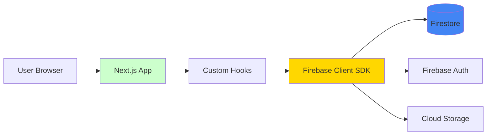
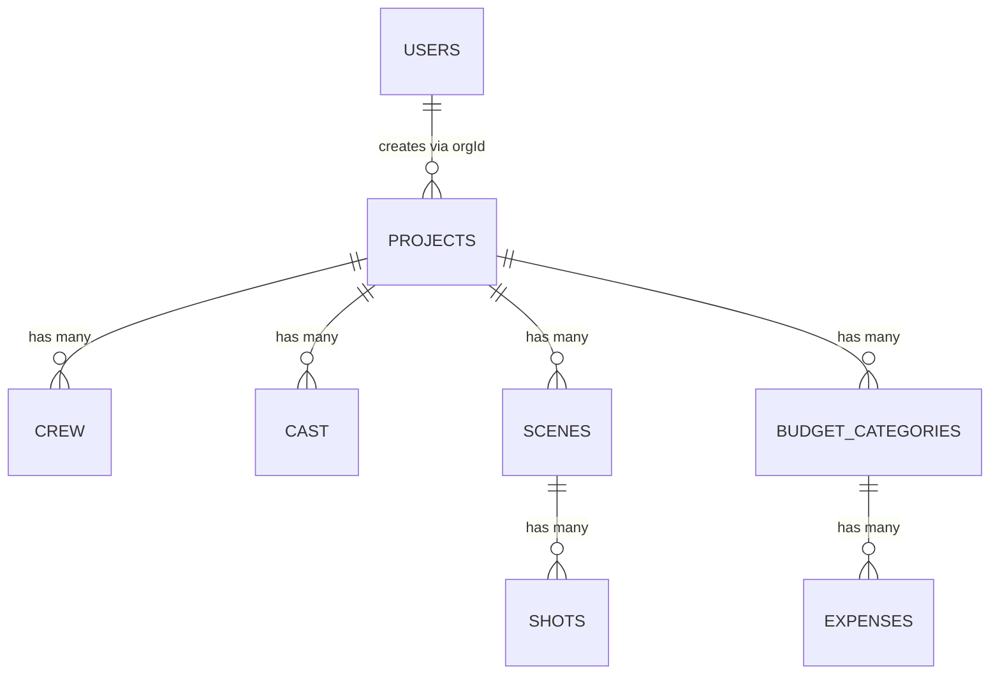

# Codebase Map & Architecture Overview

> **Status:** ✅ Current (January 2026)  
> **Architecture Version:** 2.0 - Firebase Client SDK  
> **Related Documentation:** See [ARCHITECTURE.md](ARCHITECTURE.md) for comprehensive details

---

## Quick Reference

This document provides a high-level overview of the codebase structure and how components interact. For detailed architecture documentation, see [ARCHITECTURE.md](ARCHITECTURE.md).

---

## 1. Project Structure

DOUBLEcheck is a **pnpm monorepo** using Turborepo for build orchestration.

```
doublecheck/
├── apps/
│   └── web/                    # Main Next.js 15 application
│
├── packages/
│   ├── schemas/                # Shared Zod validation schemas
│   ├── ui/                     # Shared UI components
│   ├── api/                    # ⚠️ DEPRECATED - Legacy tRPC (not used)
│   └── config/                 # Shared configs (ESLint, Tailwind, TS)
│
└── [configuration files]       # Firebase, Turbo, pnpm configs
```

---

## 2. Architecture Pattern

### Current: Direct Firebase Client SDK



**Key Characteristics:**
- ✅ **Real-time:** `onSnapshot` for live updates
- ✅ **Type-safe:** Zod schemas + TypeScript
- ✅ **Simple:** Direct browser-to-Firebase communication
- ✅ **Scalable:** No server bottleneck
- ⚠️ **Security:** Enforced via Firestore Rules (not middleware)

---

## 3. Data Flow

### Read Operations (Real-time)

```
Component
  → Custom Hook (useProjects, useCrew, etc.)
    → onSnapshot(collection/query)
      → Firestore Database
        → Real-time updates stream back
          → Hook updates state
            → Component re-renders
```

### Write Operations

```
Component
  → Mutation Hook (useCreateProject, useUpdateCrew, etc.)
    → addDoc / updateDoc / deleteDoc
      → Firestore Database
        → Success/Error callback
          → UI feedback
```

**Example:**

```typescript
// apps/web/src/features/projects/hooks/useProjects.ts
export function useProjects(status?: ProjectStatus) {
  const { user } = useAuth();
  const [projects, setProjects] = useState<Project[]>([]);
  
  useEffect(() => {
    const q = query(
      collection(db, 'projects'),
      where('orgId', '==', user.orgId),
      orderBy('createdAt', 'desc')
    );

    // Real-time subscription
    const unsubscribe = onSnapshot(q, (snapshot) => {
      const list = snapshot.docs.map(doc => ({ id: doc.id, ...doc.data() }));
      setProjects(list);
    });

    return () => unsubscribe(); // Cleanup
  }, [user?.orgId]);

  return { data: projects, isLoading };
}
```

---

## 4. Web App Structure (`apps/web`)

### Directory Layout

```
src/
├── app/                        # Next.js App Router (Pages)
│   ├── api/                    # Server-side API routes (mostly empty)
│   ├── dashboard/              # Dashboard page
│   ├── projects/               # Project pages
│   ├── login/                  # Auth pages
│   └── layout.tsx              # Root layout
│
├── features/                   # Feature modules (domain-driven)
│   ├── auth/                   # Authentication
│   ├── projects/               # Projects
│   ├── budget/                 # Budgeting
│   ├── crew/                   # Crew management
│   ├── cast/                   # Cast management
│   ├── equipment/              # Equipment
│   ├── locations/              # Locations
│   ├── scenes/                 # Scenes & shots
│   └── integrations/           # External integrations
│
├── lib/                        # Core libraries
│   ├── firebase/               # Firebase client config
│   │   ├── config.ts           # Firebase initialization
│   │   ├── auth.ts             # Auth helpers
│   │   ├── firestore.ts        # Firestore helpers
│   │   └── storage.ts          # Storage helpers
│   ├── schemas/                # Validation schemas (app-level)
│   └── stores/                 # Zustand global state
│
├── shared/                     # Shared components/utilities
│   ├── components/             # Reusable UI components
│   └── utils/                  # Utility functions
│
└── styles/                     # Global styles
```

---

## 5. Feature Module Pattern

Each feature follows a consistent structure:

```
features/{feature-name}/
├── components/               # Feature-specific UI components
│   └── {FeatureName}View.tsx
├── hooks/                    # Data fetching and mutations
│   ├── use{Feature}.ts       # Read operations
│   └── use{Feature}Templates.ts
├── stores/                   # Local state (optional)
│   └── {feature}Store.ts
└── templates/                # Default data templates (optional)
    └── {type}Template.ts
```

**Example: Projects Feature**

```
features/projects/
├── components/
│   ├── ProjectCard.tsx           # Project card component
│   ├── ReferenceGallery.tsx      # Image gallery
│   └── views/                    # Tab views
│       ├── OverviewView.tsx      # Overview tab
│       ├── BudgetView.tsx        # Budget tab
│       ├── CrewView.tsx          # Crew tab
│       └── ScheduleView.tsx      # Schedule tab
├── hooks/
│   ├── useProjects.ts            # Projects CRUD
│   ├── useBudget.ts              # Budget operations
│   ├── useSchedule.ts            # Schedule operations
│   └── useReferenceImages.ts    # Images
└── constants/
    ├── crewRoles.ts              # Default crew roles
    └── equipmentCategories.ts    # Equipment types
```

---

## 6. Key Technologies & Patterns

### Authentication

**Location:** `features/auth/`

```typescript
// useAuth hook provides:
const { user, firebaseUser, loading } = useAuth();

// user: Firestore user document (orgId, role, etc.)
// firebaseUser: Firebase Auth user (uid, email)
// loading: Initial auth check
```

**Flow:**
1. Firebase Auth login → `firebaseUser`
2. Subscribe to `users/{uid}` → `user` document
3. Store in Zustand `authStore`
4. Used by all hooks for orgId filtering

### State Management

**Global State (Zustand):**
- `authStore` - Current user session
- `themeStore` - Dark/light mode

**Local State (React):**
- Component-level useState
- Form state with controlled inputs

**Server State (Firebase):**
- Real-time via `onSnapshot`
- No React Query/SWR needed

### Form Validation

**Schemas:** Defined in `packages/schemas/` and `apps/web/src/lib/schemas/`

```typescript
// Example: Create project
import { createProjectSchema } from '@doublecheck/schemas';

const validated = createProjectSchema.parse(formData);
await useCreateProject().mutateAsync(validated);
```

---

## 7. Database Collections (Firestore)

### Primary Collections

| Collection | Documents | Purpose |
|------------|-----------|---------|
| `users` | User profiles | User info, orgId, role |
| `projects` | Projects | Project metadata |
| `crew` | Crew members | Crew assignments |
| `cast` | Cast members | Talent assignments |
| `equipment` | Equipment items | Inventory |
| `locations` | Locations | Filming locations |
| `scenes` | Scenes | Scene breakdowns |
| `shots` | Shots | Shot lists |
| `budgetCategories` | Budget line items | Budget planning |
| `expenses` | Expense records | Actual costs |
| `shootingDays` | Shooting days | Schedule days |
| `scheduleEvents` | Schedule events | Day schedule items |
| `projectMembers` | Project membership | User-project relationships |
| `integrations` | Integration configs | 3rd party connections |

### Data Relationships



---

## 8. Firebase Configuration

### Client SDK Setup

**Location:** `apps/web/src/lib/firebase/config.ts`

```typescript
import { initializeApp } from 'firebase/app';
import { getAuth } from 'firebase/auth';
import { getFirestore } from 'firebase/firestore';
import { getStorage } from 'firebase/storage';

export const app = initializeApp(firebaseConfig);
export const auth = getAuth(app);
export const db = getFirestore(app);
export const storage = getStorage(app);
```

### Security Rules

**Firestore:** `firestore.rules`  
**Storage:** `storage.rules`

⚠️ **Current rules are permissive** (allow all authenticated users). Should be tightened to enforce:
- Organization-level access control
- Role-based permissions
- Resource ownership validation

---

## 9. Development Workflow

### Start Development Server

```bash
cd doublecheck
pnpm install
pnpm dev

# Runs Next.js on http://localhost:3000
```

### Build for Production

```bash
pnpm build

# Outputs to apps/web/.next/
```

### Deploy

**Options:**
1. **Vercel** (recommended): `vercel`
2. **Firebase Hosting**: `firebase deploy`
3. **Cloud Run**: `./scripts/deploy-cloudrun.sh`

---

## 10. Common Patterns

### Creating a New Feature

1. **Create directory:** `src/features/my-feature/`
2. **Define schema:** `packages/schemas/src/my-feature.ts`
3. **Create hook:** `hooks/useMyFeature.ts` with `onSnapshot` pattern
4. **Build component:** `components/MyFeatureView.tsx`
5. **Add to page:** Import into relevant view

### Adding a Firestore Collection

1. **Define schema:** In `packages/schemas/`
2. **Create hooks:** CRUD operations
3. **Add indexes:** In `firestore.indexes.json` if using compound queries
4. **Update security rules:** In `firestore.rules`
5. **Deploy:** `firebase deploy --only firestore`

---

## 11. Migration Notes

### ⚠️ Deprecated: packages/api

The `packages/api` package contains legacy tRPC routers and Firebase Admin SDK code that is **no longer used**. See [TRPC_AUDIT.md](TRPC_AUDIT.md) for details.

**Status:** All functionality migrated to direct Firebase Client SDK calls in hooks.

**Action:** Can be safely removed or archived.

---

## 12. Key Files Reference

### Configuration

| File | Purpose |
|------|---------|
| `turbo.json` | Turborepo task pipeline |
| `pnpm-workspace.yaml` | Workspace package definitions |
| `firebase.json` | Firebase project config |
| `firestore.rules` | Database security rules |
| `firestore.indexes.json` | Query indexes |
| `apps/web/next.config.js` | Next.js configuration |
| `apps/web/tailwind.config.js` | Tailwind CSS config |

### Core Application Files

| File | Purpose |
|------|---------|
| `apps/web/src/lib/firebase/config.ts` | Firebase initialization |
| `apps/web/src/features/auth/hooks/useAuth.ts` | Authentication hook |
| `apps/web/src/app/layout.tsx` | Root app layout |
| `packages/schemas/src/index.ts` | Schema exports |

---

## 13. Troubleshooting

### "Permission denied" in Firestore

**Cause:** Security rules or missing orgId  
**Fix:** Check `firestore.rules` and ensure user.orgId matches resource.data.orgId

### Real-time updates not working

**Cause:** Missing index or incorrect query  
**Fix:** Check browser console for Firestore errors, deploy indexes if needed

### Build errors

**Cause:** Type errors or missing dependencies  
**Fix:** Run `pnpm install` from workspace root, check TypeScript errors

---

## 14. Performance Considerations

- **Limit queries:** Use `.limit()` to cap results
- **Index queries:** All `where` + `orderBy` combos need indexes
- **Unsubscribe:** Always clean up `onSnapshot` listeners
- **Pagination:** Implement for large lists (100+ items)

---

## 15. Next Steps

See [ARCHITECTURE.md](ARCHITECTURE.md) for:
- Detailed data flow diagrams
- Complete feature module documentation
- Deployment guides
- Security best practices
- Contributing guidelines

---

**Last Updated:** January 2026  
**Maintained By:** DOUBLEcheck Team
