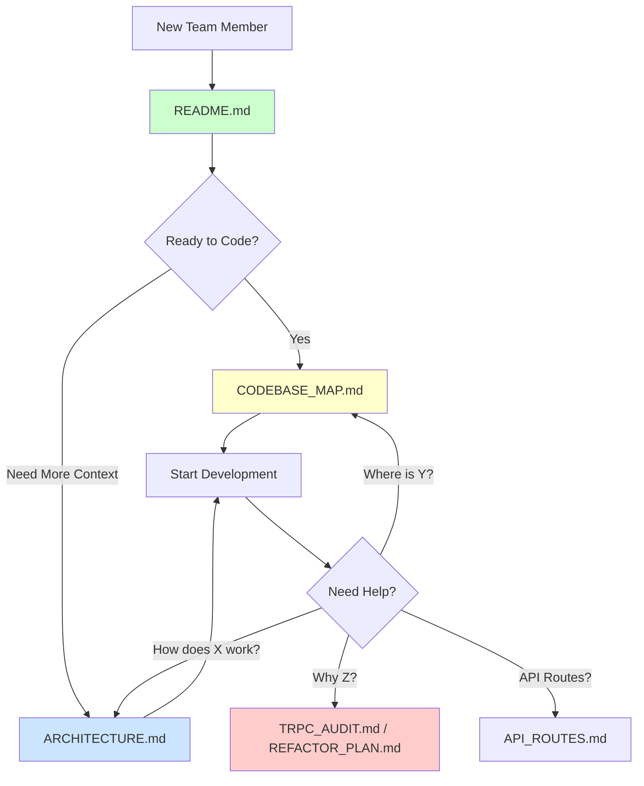

# Documentation Index

> **Complete guide to DOUBLEcheck documentation**  
> **Last Updated:** January 2026

This index provides quick access to all project documentation. Start here to find what you need.

---

## 📖 Quick Start

**New to the project?** Read these in order:

1. **[README.md](README.md)** - Project overview and setup instructions
2. **[CODEBASE_MAP.md](CODEBASE_MAP.md)** - Code structure and patterns
3. **[ARCHITECTURE.md](ARCHITECTURE.md)** - Detailed architecture documentation

---

## 📚 Documentation Files

### Core Documentation

| Document | Purpose | Audience | Status |
|----------|---------|----------|--------|
| **[README.md](README.md)** | Project overview, quick start, features | Everyone | ✅ Current |
| **[ARCHITECTURE.md](ARCHITECTURE.md)** | Complete architecture reference | Developers | ✅ Current |
| **[CODEBASE_MAP.md](CODEBASE_MAP.md)** | Code structure, data flow, patterns | Developers | ✅ Current |

### Technical Audits & Analysis

| Document | Purpose | Audience | Status |
|----------|---------|----------|--------|
| **[TRPC_AUDIT.md](TRPC_AUDIT.md)** | tRPC removal audit and migration verification | Architects, Leads | ✅ Current |
| **[API_ROUTES.md](API_ROUTES.md)** | API routes documentation and recommendations | Developers | ✅ Current |

### Historical Reference

| Document | Purpose | Audience | Status |
|----------|---------|----------|--------|
| **[REFACTOR_PLAN.md](REFACTOR_PLAN.md)** | Migration plan and history (tRPC → Firebase) | Architects | 📦 Archived |

---

## 🗺️ Documentation Map

### When to Read What



---

## 📋 By Topic

### Getting Started

- **Setup & Installation:** [README.md](README.md)
- **Environment Configuration:** [env.example](env.example)
- **Project Structure:** [CODEBASE_MAP.md](CODEBASE_MAP.md)

### Architecture & Design

- **Overview:** [ARCHITECTURE.md](ARCHITECTURE.md) (Overview section)
- **Data Flow:** [ARCHITECTURE.md](ARCHITECTURE.md) (Data Flow section)
- **Technology Stack:** [ARCHITECTURE.md](ARCHITECTURE.md) (Technology Stack section)
- **Monorepo Structure:** [CODEBASE_MAP.md](CODEBASE_MAP.md) (High-Level Structure)

### Features & Modules

- **Feature List:** [README.md](README.md) (Features section)
- **Feature Architecture:** [ARCHITECTURE.md](ARCHITECTURE.md) (Feature Modules section)
- **Feature Patterns:** [CODEBASE_MAP.md](CODEBASE_MAP.md) (Feature Module Pattern)

### Database & Firebase

- **Collections Schema:** [ARCHITECTURE.md](ARCHITECTURE.md) (Database Schema section)
- **Security Rules:** [firestore.rules](firestore.rules)
- **Indexes:** [firestore.indexes.json](firestore.indexes.json)
- **Firebase Config:** [firebase.json](firebase.json)

### Development

- **Development Workflow:** [ARCHITECTURE.md](ARCHITECTURE.md) (Development Workflow section)
- **Adding Features:** [CODEBASE_MAP.md](CODEBASE_MAP.md) (Common Patterns section)
- **Code Patterns:** [CODEBASE_MAP.md](CODEBASE_MAP.md) (Key Technologies section)

### Deployment

- **Deployment Options:** [ARCHITECTURE.md](ARCHITECTURE.md) (Deployment section)
- **Vercel Deployment:** [README.md](README.md) (Deployment section)
- **Firebase Deployment:** [API_ROUTES.md](API_ROUTES.md) (Cloud Functions)
- **Docker Deployment:** [Dockerfile](Dockerfile)

### API & Server-Side

- **API Routes Status:** [API_ROUTES.md](API_ROUTES.md)
- **Server-Side Checklist:** [API_ROUTES.md](API_ROUTES.md) (Server-Side Features)

### Migration History

- **tRPC Removal:** [TRPC_AUDIT.md](TRPC_AUDIT.md)
- **Refactor Plan:** [REFACTOR_PLAN.md](REFACTOR_PLAN.md)
- **Migration Lessons:** [REFACTOR_PLAN.md](REFACTOR_PLAN.md) (Lessons Learned)

### Troubleshooting

- **Common Issues:** [README.md](README.md) (Troubleshooting section)
- **Performance Tips:** [ARCHITECTURE.md](ARCHITECTURE.md) (Performance Considerations)
- **Security Issues:** [ARCHITECTURE.md](ARCHITECTURE.md) (Authentication & Authorization)

---

## 🎯 Quick Reference

### For New Developers

**Day 1:** Read [README.md](README.md) → Set up environment → Run `pnpm dev`  
**Day 2:** Explore [CODEBASE_MAP.md](CODEBASE_MAP.md) → Understand project structure  
**Week 1:** Study [ARCHITECTURE.md](ARCHITECTURE.md) → Learn patterns and conventions

### For Contributors

1. Check [README.md](README.md) for commit conventions
2. Review [CODEBASE_MAP.md](CODEBASE_MAP.md) for code patterns
3. Follow feature structure in [ARCHITECTURE.md](ARCHITECTURE.md)

### For Architects

1. Review [ARCHITECTURE.md](ARCHITECTURE.md) for system design
2. Check [TRPC_AUDIT.md](TRPC_AUDIT.md) for migration status
3. See [API_ROUTES.md](API_ROUTES.md) for server-side recommendations

### For DevOps

1. Read [ARCHITECTURE.md](ARCHITECTURE.md) Deployment section
2. Check [firebase.json](firebase.json) for Firebase config
3. Review [Dockerfile](Dockerfile) for containerization

---

## 📊 Documentation Coverage

### Codebase Areas

| Area | Documentation | Status |
|------|---------------|--------|
| **Frontend** | ✅ Complete | ARCHITECTURE.md, CODEBASE_MAP.md |
| **Backend/Firebase** | ✅ Complete | ARCHITECTURE.md, API_ROUTES.md |
| **Database** | ✅ Complete | ARCHITECTURE.md (Database Schema) |
| **Authentication** | ✅ Complete | ARCHITECTURE.md (Auth section) |
| **Deployment** | ✅ Complete | README.md, ARCHITECTURE.md |
| **Development** | ✅ Complete | CODEBASE_MAP.md, ARCHITECTURE.md |
| **Testing** | ⚠️ Basic | README.md (needs expansion) |
| **CI/CD** | ❌ Missing | (if needed) |

---

## 🔄 Keeping Documentation Updated

### When to Update

- **Code changes:** Update [CODEBASE_MAP.md](CODEBASE_MAP.md)
- **Architecture changes:** Update [ARCHITECTURE.md](ARCHITECTURE.md)
- **New features:** Update [README.md](README.md) feature list
- **Database changes:** Update [ARCHITECTURE.md](ARCHITECTURE.md) schema section
- **Deployment changes:** Update [ARCHITECTURE.md](ARCHITECTURE.md) deployment section

### Documentation Owners

| Document | Owner | Update Frequency |
|----------|-------|------------------|
| README.md | Product Lead | Per major release |
| ARCHITECTURE.md | Tech Lead | Per architecture change |
| CODEBASE_MAP.md | Senior Developers | Per significant refactor |
| TRPC_AUDIT.md | Architects | One-time (complete) |
| API_ROUTES.md | Backend Lead | When adding server routes |

---

## 🎓 Learning Path

### Beginner → Intermediate

1. ✅ Read [README.md](README.md) - Understand what the app does
2. ✅ Follow setup in [README.md](README.md) - Get app running locally
3. ✅ Scan [CODEBASE_MAP.md](CODEBASE_MAP.md) - Learn project structure
4. ✅ Make small changes - Fix typos, update styles
5. ✅ Read feature modules in [ARCHITECTURE.md](ARCHITECTURE.md)
6. ✅ Implement a simple feature - Add a field to existing form

### Intermediate → Advanced

1. ✅ Deep dive [ARCHITECTURE.md](ARCHITECTURE.md) - Understand all patterns
2. ✅ Read [TRPC_AUDIT.md](TRPC_AUDIT.md) - Understand migration decisions
3. ✅ Study Firestore queries in hooks - Learn optimization
4. ✅ Implement complex feature - New module with CRUD operations
5. ✅ Review [API_ROUTES.md](API_ROUTES.md) - Plan server-side features
6. ✅ Optimize performance - Database indexes, query optimization

---

## 📝 Document Templates

### Adding New Documentation

When creating new documentation, follow this structure:

```markdown
# Document Title

> **Status:** [Current/Archived/Draft]  
> **Last Updated:** [Date]

## Overview
Brief description of document purpose

## Table of Contents
- Links to major sections

## Content Sections
Organized, clear sections with examples

## Related Documentation
Links to related docs

---

**Last Updated:** [Date]  
**Maintained By:** [Team/Person]
```

---

## 🔗 External Resources

### Framework Documentation

- **Next.js:** https://nextjs.org/docs
- **React:** https://react.dev/
- **TypeScript:** https://www.typescriptlang.org/docs/
- **Tailwind CSS:** https://tailwindcss.com/docs

### Firebase

- **Firebase Console:** https://console.firebase.google.com/project/doublecheck-9f8c1
- **Firestore Docs:** https://firebase.google.com/docs/firestore
- **Firebase Auth:** https://firebase.google.com/docs/auth
- **Storage:** https://firebase.google.com/docs/storage

### Tools

- **Turborepo:** https://turbo.build/repo/docs
- **pnpm:** https://pnpm.io/
- **Zod:** https://zod.dev/
- **Zustand:** https://github.com/pmndrs/zustand

---

## ✅ Documentation Checklist

Use this checklist when onboarding or reviewing docs:

### For New Team Members

- [ ] Read README.md for project overview
- [ ] Set up development environment
- [ ] Explore CODEBASE_MAP.md for structure
- [ ] Review ARCHITECTURE.md sections relevant to your role
- [ ] Understand data flow and patterns
- [ ] Know where to find answers (this index!)

### For Code Reviews

- [ ] Check if changes require documentation updates
- [ ] Verify code follows patterns in CODEBASE_MAP.md
- [ ] Ensure architecture decisions align with ARCHITECTURE.md
- [ ] Update relevant docs if needed

### For Releases

- [ ] Update README.md version/features if needed
- [ ] Review ARCHITECTURE.md for accuracy
- [ ] Check all documentation links work
- [ ] Update "Last Updated" dates

---

## 🎉 Documentation Complete

All primary documentation is now **current and comprehensive**. This project has:

- ✅ Clear getting started guide
- ✅ Detailed architecture documentation
- ✅ Code structure reference
- ✅ Migration history and audits
- ✅ API and server-side documentation
- ✅ This index to find everything!

**Happy coding! 🚀**

---

**Created:** January 2026  
**Purpose:** Central documentation index  
**Maintained By:** DOUBLEcheck Team

