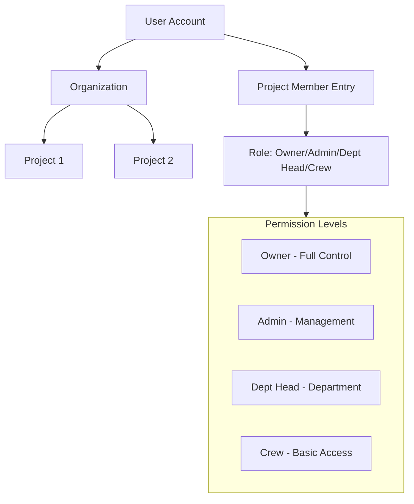

# Project Hierarchy & Permission System

> **Complete explanation of how roles, permissions, and project ownership works**

---

## 🏗️ **Architecture Overview**

DOUBLEcheck uses a **two-tier membership system**:

1. **Organization Level** (`users` collection) - Company/team membership
2. **Project Level** (`project_members` collection) - Individual project access



---

## 📊 **How It Works**

### **Project Creation Flow**

```
User clicks "Create Project"
  ↓
useCreateProject() called
  ↓
1. Create project document
   - orgId: user.orgId
   - createdBy: user.id
   - status, budget, dates, etc.
  ↓
2. Create project_members entry (AUTOMATIC)
   - projectId: new project ID
   - userId: user.id
   - email: user.email
   - displayName: user.displayName
   - role: 'owner'               ← Creator is OWNER
   - status: 'active'
   - invitedBy: user.id
   - joinedAt: now
  ↓
3. User now has full project control
```

### **Permission Check Flow**

```
User opens project
  ↓
useMyRole(projectId) called
  ↓
Query project_members:
  - where projectId == current project
  - where userId == current user
  ↓
Found entry? → Use that role (owner/admin/dept_head/crew)
  ↓
Not found? → Fallback check:
  - Get project document
  - Check if createdBy == user.id
  - If yes → Grant 'owner' role
  - If no → No access (null)
  ↓
Role used for UI permissions:
  - canEdit = role === 'owner' || role === 'admin'
  - canDelete = role === 'owner'
  - canInvite = role === 'owner' || role === 'admin'
```

---

## 🔐 **Role Hierarchy**

### **1. Owner** (Highest Permission)

**Who:**
- Project creator (automatically)
- Can be transferred to another user
- Only ONE owner per project

**Permissions:**
- ✅ Full control over everything
- ✅ Delete project
- ✅ Transfer ownership
- ✅ Manage all team members
- ✅ Assign/remove department heads
- ✅ Review all role requests
- ✅ Modify project settings
- ✅ Access all tabs and features
- ❌ **Cannot be removed** by others

**Collection Entry:**
```typescript
{
  projectId: string,
  userId: string,
  role: 'owner',
  status: 'active',
  // ...
}
```

### **2. Admin** (High Permission)

**Who:**
- Promoted by owner
- Can be multiple admins
- Typically producers, coordinators

**Permissions:**
- ✅ Manage team members (invite, remove, change roles except owner)
- ✅ Assign/remove department heads
- ✅ Review all role requests
- ✅ Modify budget, schedule, crew, cast, equipment
- ✅ Access all tabs
- ❌ **Cannot** delete project
- ❌ **Cannot** transfer ownership
- ❌ **Can be demoted** by owner

**Collection Entry:**
```typescript
{
  projectId: string,
  userId: string,
  role: 'admin',
  status: 'active',
  // ...
}
```

### **3. Department Head** (Department Permission)

**Who:**
- Assigned by owner/admin
- Can be multiple (one per department or multiple depts)
- Typically: DP (Camera), Gaffer (Lighting), Sound Mixer, etc.

**Permissions:**
- ✅ Review role requests **for their departments only**
- ✅ View team members (read-only)
- ✅ Edit project content (crew, scenes, etc.)
- ❌ **Cannot** invite/remove team members
- ❌ **Cannot** modify project settings
- ❌ **Cannot** delete project

**Collection Entries:**
```typescript
// In project_members:
{
  projectId: string,
  userId: string,
  role: 'dept_head',
  status: 'active',
}

// In department_heads:
{
  projectId: string,
  userId: string,
  department: 'Camera', // or 'Lighting', 'Sound', etc.
  assignedAt: timestamp
}
```

### **4. Crew** (Basic Permission)

**Who:**
- Default role for team members
- Anyone working on the project

**Permissions:**
- ✅ View project content
- ✅ View team members (read-only)
- ✅ Edit their assigned work
- ❌ **Cannot** invite others
- ❌ **Cannot** modify settings
- ❌ **Cannot** delete anything major

**Collection Entry:**
```typescript
{
  projectId: string,
  userId: string,
  role: 'crew',
  status: 'active',
}
```

---

## 🔄 **Collections & Relationships**

### **Collection: `projects`**

```typescript
{
  id: string,
  orgId: string,              // Which organization owns this
  title: string,
  createdBy: string,          // User ID of creator
  isClonedDemo?: boolean,     // Flag for cloned Nike demos
  isPublic?: boolean,         // Original demo (read-only)
  // ...other fields
}
```

### **Collection: `project_members`**

```typescript
{
  id: string,
  projectId: string,          // FK to projects
  userId: string,             // FK to users
  email: string,
  displayName: string,
  role: 'owner' | 'admin' | 'dept_head' | 'crew',
  status: 'pending' | 'active' | 'declined',
  invitedBy: string,          // User ID who invited
  invitedAt: timestamp,
  joinedAt?: timestamp,       // When they accepted
}
```

### **Collection: `department_heads`**

```typescript
{
  id: string,
  projectId: string,          // FK to projects
  userId: string,             // FK to users (must be in project_members)
  department: string,         // 'Camera', 'Lighting', 'Sound', etc.
  assignedAt: timestamp,
}
```

**Key Rule:** User must be an active project member BEFORE being assigned as department head.

---

## 🔧 **Implementation Details**

### **When Creating a New Project**

**File:** `apps/web/src/features/projects/hooks/useProjects.ts`

```typescript
export function useCreateProject() {
  const mutateAsync = async (data: any) => {
    // 1. Create project
    const docRef = await addDoc(collection(db, 'projects'), {
      ...data,
      orgId: user.orgId,
      createdBy: user.id,
      createdAt: serverTimestamp(),
    });

    // 2. AUTO-ADD creator as owner
    await addDoc(collection(db, 'project_members'), {
      projectId: docRef.id,
      userId: user.id,
      email: user.email,
      displayName: user.displayName,
      role: 'owner',        // ← Automatic owner role
      status: 'active',
      invitedBy: user.id,
      invitedAt: serverTimestamp(),
      joinedAt: serverTimestamp(),
    });

    return { id: docRef.id };
  };
}
```

### **When Cloning Nike Demo**

**File:** `apps/web/src/lib/firebase/cloneDemo.ts`

```typescript
export async function cloneNikeDemoForUser(userId, orgId) {
  // 1. Clone project with user's orgId
  const newProject = await addDoc(collection(db, 'projects'), {
    ...demoProject,
    orgId,                  // User's org
    createdBy: userId,      // User as creator
    isClonedDemo: true,     // Flag for DEMO badge
    isPublic: false,        // User can edit
  });

  // 2. Clone all data (crew, cast, equipment, etc.)
  // ...

  // 3. ADD USER AS OWNER
  await addDoc(collection(db, 'project_members'), {
    projectId: newProject.id,
    userId,
    email: userData.email,
    displayName: userData.displayName,
    role: 'owner',          // ← User owns their clone
    status: 'active',
  });

  return newProject.id;
}
```

### **Permission Checking**

**File:** `apps/web/src/features/projectMembers/hooks/useProjectMembers.ts`

```typescript
export function useMyRole(projectId: string) {
  // 1. Check project_members collection
  const memberEntry = await query(
    collection(db, 'project_members'),
    where('projectId', '==', projectId),
    where('userId', '==', user.id)
  );

  if (memberEntry.exists) {
    return memberEntry.role;  // owner, admin, dept_head, crew
  }

  // 2. FALLBACK: Check if user created project
  const project = await getDoc(doc(db, 'projects', projectId));
  if (project.data().createdBy === user.id) {
    return 'owner';  // Creator is owner even without member entry
  }

  return null;  // Not a member
}
```

### **Deleting Projects**

**File:** `apps/web/src/features/projects/hooks/useProjects.ts`

```typescript
export function useDeleteProject() {
  const mutateAsync = async ({ id }) => {
    const project = await getDoc(doc(db, 'projects', id));
    const projectData = project.data();

    // Check permissions:
    // 1. User created project (createdBy), OR
    // 2. User owns the org (orgId matches)
    if (projectData.createdBy !== user.id && 
        projectData.orgId !== user.orgId) {
      throw new Error('No permission');
    }

    // Can delete:
    // - Own projects
    // - Cloned demos (isClonedDemo: true, orgId: user.orgId)
    await deleteDoc(doc(db, 'projects', id));
  };
}
```

---

## 🎯 **Permission Matrix**

| Feature | Owner | Admin | Dept Head | Crew |
|---------|-------|-------|-----------|------|
| **View project** | ✅ | ✅ | ✅ | ✅ |
| **Edit crew/cast/equipment** | ✅ | ✅ | ✅ | ✅ |
| **Upload files** | ✅ | ✅ | ✅ | ✅ |
| **Invite team members** | ✅ | ✅ | ❌ | ❌ |
| **Remove team members** | ✅ | ✅ | ❌ | ❌ |
| **Change member roles** | ✅ | ✅* | ❌ | ❌ |
| **Assign dept heads** | ✅ | ✅ | ❌ | ❌ |
| **Review all role requests** | ✅ | ✅ | ❌ | ❌ |
| **Review dept role requests** | ✅ | ✅ | ✅ | ❌ |
| **Modify project settings** | ✅ | ✅ | ❌ | ❌ |
| **Delete project** | ✅ | ❌ | ❌ | ❌ |
| **Transfer ownership** | ✅ | ❌ | ❌ | ❌ |

\* Admin can change roles but cannot promote to owner or demote owner

---

## 🎬 **Nike Demo Project Hierarchy**

### **Original Demo** (Template in Firebase)

```typescript
{
  id: 'demo-nike-project',
  orgId: 'demo-public',
  isPublic: true,              // Read-only for everyone
  createdBy: 'system',
}
```

**Who can access:** Everyone (read-only)  
**Who can edit:** Nobody  
**Purpose:** Template for cloning

### **Cloned Demo** (User's Copy)

```typescript
{
  id: 'xyz123...',             // Unique ID
  orgId: 'org-user123',        // User's org
  isClonedDemo: true,          // Shows DEMO badge
  isPublic: false,             // Private to user
  createdBy: 'user123',        // User who cloned it
}

// project_members entry:
{
  projectId: 'xyz123...',
  userId: 'user123',
  role: 'owner',               // User is owner!
  status: 'active',
}
```

**Who can access:** User's org  
**Who can edit:** User (owner) and invited team members  
**Who can delete:** User (owner)  
**Purpose:** Fully functional demo for learning

---

## ✅ **What Was Fixed**

### **Before (Broken):**
```typescript
// useCreateProject - MISSING step
const docRef = await addDoc(collection(db, 'projects'), projectData);
return { id: docRef.id };  // ← No project_members entry!
```

**Result:**
- ❌ Creator wasn't added to project_members
- ❌ useMyRole returned null
- ❌ canEdit was false
- ❌ Couldn't manage own project
- ❌ Couldn't delete own project

### **After (Fixed):**
```typescript
// useCreateProject - COMPLETE
const docRef = await addDoc(collection(db, 'projects'), projectData);

// AUTO-ADD creator as owner
await addDoc(collection(db, 'project_members'), {
  projectId: docRef.id,
  userId: user.id,
  role: 'owner',              // ← Now properly set!
  status: 'active',
});

return { id: docRef.id };
```

**Result:**
- ✅ Creator added to project_members
- ✅ useMyRole returns 'owner'
- ✅ canEdit is true
- ✅ Full project control
- ✅ Can delete own project

---

## 🧪 **Testing the Hierarchy**

### **Test 1: Create New Project**

1. Sign in to app
2. Click "+ New Project"
3. Fill form and create
4. **Expected:** You are automatically the owner
5. **Verify:** Go to Admin tab → Team Management → See yourself as "Owner"

### **Test 2: Clone Nike Demo**

1. Click "Get Nike Demo Project"
2. Wait for clone to complete
3. **Expected:** Nike project appears with DEMO badge
4. **Verify:** 
   - Can edit everything (crew, cast, equipment, scenes)
   - Admin tab shows you as "Owner"
   - Can delete the project (trash icon shows on hover)

### **Test 3: Invite Team Member**

1. Open any project
2. Go to Admin tab → Team Management
3. Click "+ Invite Team Member"
4. Enter email, select role (Admin/Dept Head/Crew)
5. Send invite
6. **Expected:** Member added to list with "Pending" status
7. **When they accept:** Status becomes "Active"

### **Test 4: Department Head Assignment**

1. Go to Admin tab → Department Heads
2. See list of departments (Camera, Lighting, Sound, etc.)
3. Click "Assign Head" for Camera department
4. Select a team member (must be active)
5. **Expected:** 
   - Member assigned as Camera dept head
   - They can now review Camera department role requests
   - Still have their base role (admin/crew)

### **Test 5: Role Requests**

1. External person visits project (if shared/public)
2. Clicks "Request to Join"
3. Fills form (department, role, message)
4. Submits
5. **Expected:**
   - Request appears in Admin tab → Role Requests
   - Department head OR admin/owner can review
   - Approve → Person added to team with requested role
   - Deny → Request closed

---

## 🛠️ **Implementation Files**

### **Key Files:**

1. **`apps/web/src/features/projects/hooks/useProjects.ts`**
   - `useCreateProject()` - Creates project + owner entry
   - `useDeleteProject()` - Checks permissions before delete

2. **`apps/web/src/features/projectMembers/hooks/useProjectMembers.ts`**
   - `useMyRole()` - Gets user's role for permission checks
   - `useAddProjectMember()` - Invites new members
   - `useUpdateMemberRole()` - Changes roles
   - `useRemoveProjectMember()` - Removes members

3. **`apps/web/src/features/projectMembers/hooks/useDepartmentHeads.ts`**
   - `useDepartmentHeads()` - Lists department assignments
   - `assignHead()` - Assigns member to department
   - `removeHead()` - Unassigns department head

4. **`apps/web/src/features/projectMembers/hooks/useRoleRequests.ts`**
   - `useRoleRequests()` - Lists requests
   - `reviewRequest()` - Approve/deny requests

5. **`apps/web/src/features/projects/components/views/AdminView.tsx`**
   - Complete admin panel UI
   - All 4 tabs rendered based on role
   - Permission-based visibility

---

## 📋 **Collection Structure**

### **`projects`**
```typescript
{
  id: 'proj_abc123',
  orgId: 'org-user456',      // Which org owns this
  createdBy: 'user456',       // Who created it
  title: 'Nike Commercial',
  // ...
}
```

### **`project_members`**
```typescript
{
  id: 'member_xyz789',
  projectId: 'proj_abc123',   // FK to projects
  userId: 'user456',          // FK to users
  email: 'user@example.com',
  displayName: 'John Doe',
  role: 'owner',              // owner, admin, dept_head, crew
  status: 'active',           // pending, active, declined
  invitedBy: 'user456',
  invitedAt: timestamp,
  joinedAt: timestamp,
}
```

### **`department_heads`**
```typescript
{
  id: 'head_qrs456',
  projectId: 'proj_abc123',   // FK to projects
  userId: 'user789',          // FK to users (must be in project_members)
  department: 'Camera',
  assignedAt: timestamp,
}
```

### **`role_requests`**
```typescript
{
  id: 'request_tuv012',
  projectId: 'proj_abc123',   // FK to projects
  requestedByUserId: 'user999',
  requestedByEmail: 'freelancer@example.com',
  requestedByName: 'Jane Smith',
  requestedRole: 'crew',
  requestedDepartment: 'Sound',
  message: 'I have 5 years of boom operating experience...',
  status: 'pending',          // pending, approved, denied, cancelled
  reviewNote?: string,
  reviewedBy?: string,
  createdAt: timestamp,
  reviewedAt?: timestamp,
}
```

---

## 🎯 **Best Practices**

### **Setting Up a Production Team**

**Step 1: Create Project**
- You're automatically the owner

**Step 2: Invite Core Team**
- Producer → Admin
- Line Producer → Admin
- Production Coordinator → Crew

**Step 3: Assign Department Heads**
- DP → Camera department head
- Gaffer → Lighting department head
- Key Grip → Grip department head
- Sound Mixer → Sound department head
- etc.

**Step 4: Open to Crew**
- Share project link
- Crew can request to join
- Department heads approve for their departments
- Or admins bulk-invite known crew

### **Role Promotion Path**

```
Crew Member (joins team)
  ↓
Proves valuable, gains trust
  ↓
Admin promotes to Department Head
  ↓
Gains department management responsibilities
  ↓
For key personnel: Promote to Admin
  ↓
Full project management access
```

---

## 🔐 **Security Rules**

**File:** `firestore.rules`

```javascript
// Project members can only see members of projects they're in
match /project_members/{memberId} {
  allow read: if request.auth != null &&
                 (resource.data.userId == request.auth.uid ||
                  exists(/databases/$(database)/documents/project_members/$(memberId)));
  allow write: if request.auth != null &&
                  // Check if user is owner/admin of this project
                  exists(/databases/$(database)/documents/project_members/$(memberId));
}
```

---

## ✅ **Summary of Fixes**

1. ✅ **useCreateProject** - Now auto-adds creator as owner
2. ✅ **useMyRole** - Fallback checks if user created project
3. ✅ **useDeleteProject** - Permission check before deleting
4. ✅ **cloneNikeDemoForUser** - Sets user as owner with proper info
5. ✅ **ProjectCard** - Delete button shows for owned projects (not public template)
6. ✅ **All admin features** - Fully functional with proper permissions

---

## 🎉 **Result**

**Now when you:**

- ✅ **Create a project** → You're automatically the owner with full control
- ✅ **Clone Nike demo** → You're the owner of your copy
- ✅ **Can delete** cloned demos (your projects)
- ✅ **Cannot delete** original public demo (preserved for others)
- ✅ **Admin tab works** with proper role display
- ✅ **Invite team members** and assign roles
- ✅ **Permission system** functions as designed

**All hierarchy and permissions now working as originally designed!** 🚀

---

**Last Updated:** January 5, 2026  
**Status:** ✅ Fully Implemented

